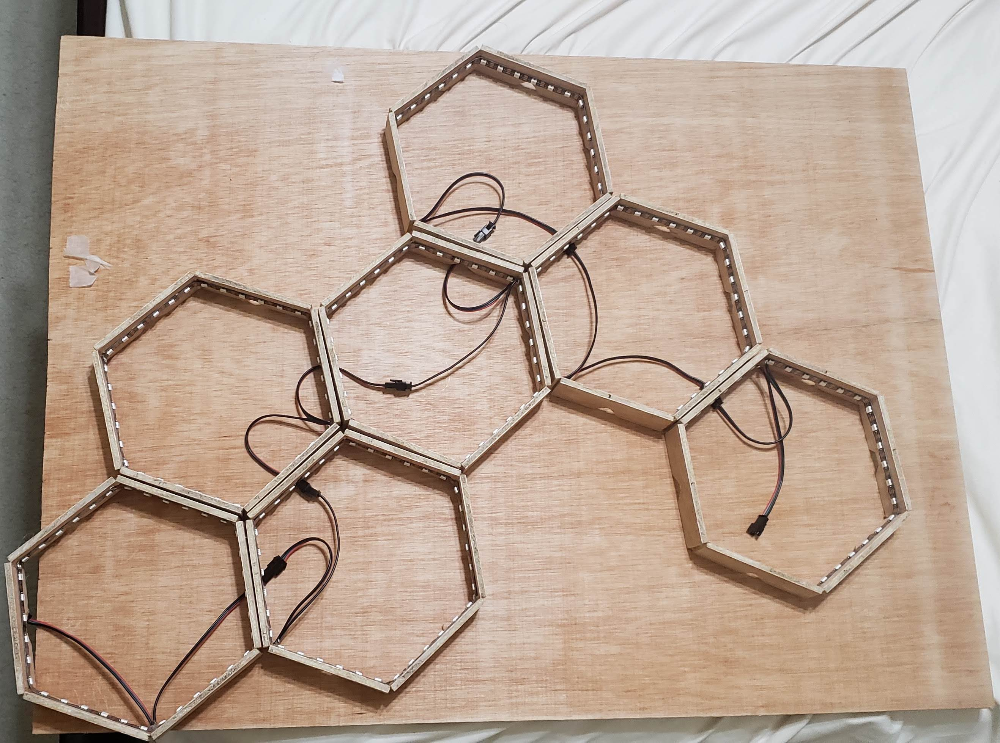
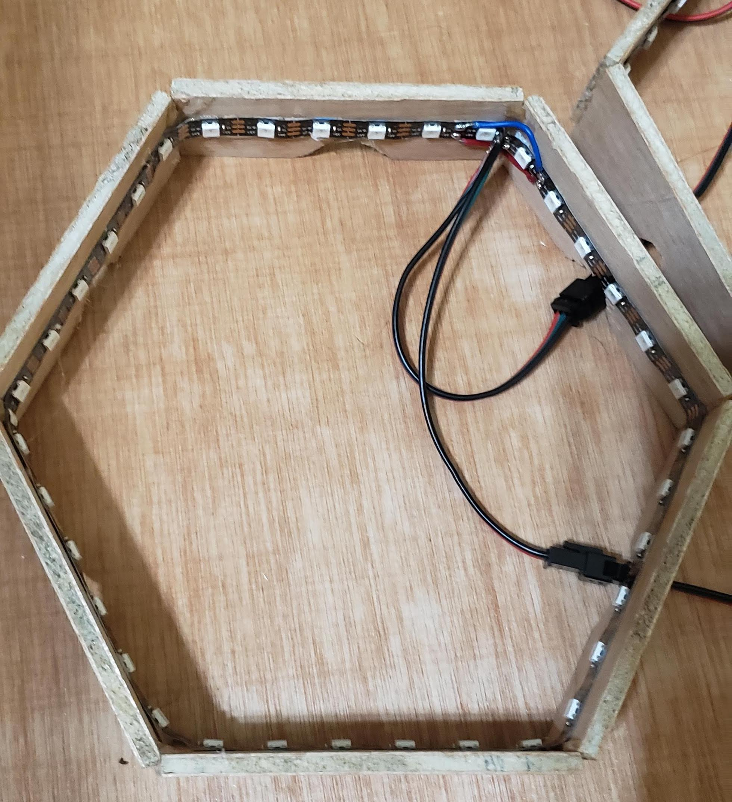

# HelioHex

This repository contains my work for a dynamic LED lighting display project.

### Demo

### Features

* Different lighting 'modes' - examples include:
	* Set the color of the whole display
	* Set the color of individual hexagons
	* Generate a random aesthetically-pleasing color palette
	* Sync the color of the display to the time of the day
* Spotify integration
	* Matches up the colors of each hexagon to the features of the song playing
	* Changes depending on the emotions of the song e.g. sadder songs are more blue
* Adaptable web controller - use any device on the network to control the device
	* Control all the different modes and brightness of the display
	* Shows a virtual visualization of the display
* Flexible design
	* Arrange the hexagons in whatever pattern you like - change the settings in one file and everything automatically updates
	* Each hexagon acts as its own unit - if you build more hexagons, you can easily expand the structure

### Under the Hood

This is how the structure display looks without the light diffusing sheets on top. Each hexagon has a JST connector so that it can connect to any hexagon in whatever way you want to plug them in. 

This is a closer look of each individual hexagon. Each hexagon consists of wood pieces I cut out and glued together. A piece of an individual addressable LED strip is attached to the inner perimeter of each hexagon. At the end of these LED strips are the soldered connections. The wood planks have notches at the bottom of each side for connecting pieces of wire to pass through. The small blue and red wires at the top right connect the ground and 5V wires of the ends of the LED strip together to ensure thatthere is sufficient power that can pass to the entire display.

### Cost

| Material | Where to find it | Cost |
| -- | -- | -- |
| LED Strip | https://www.amazon.com/CHINLY-Individually-Addressable-Waterproof-waterproof/dp/B06XNJSKXN/ref=sr_1_5 | $29.90 |
| JST Connectors | https://www.amazon.com/ALITOVE-Female-Connector-WS2812B-SK6812-RGBW/dp/B071H5XCN5/ref=sr_1_5 | $10.99 |
| Remote Controller | https://www.amazon.com/dp/B075SXMD9Z/ref=sspa_dk_detail_3 | $8.99 |
| Plywood | https://www.homedepot.com/p/Utility-Panel-Common-1-8-in-x-4-ft-x-8-ft-Actual-0-106-in-x-48-in-x-96-in-833096/100543684 (might not be the exact one I used, need to double check) | $11.42 |
| Acrylic Light Panel | https://www.homedepot.com/p/OPTIX-23-75-in-x-47-75-in-White-Acrylic-Light-Panel-1A20084A/100564898 | $12.48 |
| Raspberry Pi 4 | https://www.microcenter.com/product/608436/raspberry-pi-4-model-b---2gb-ddr4 | $35.00 |
| 40 Amp Power Supply | https://www.amazon.com/CHINLY-Universal-Regulated-Switching-Transformer/dp/B01LZRIWZD/ref=sr_1_4 | $20.99
